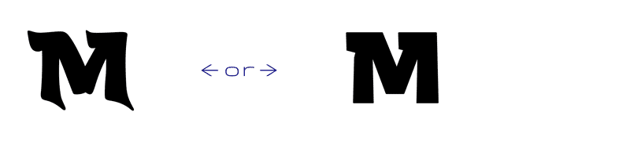

    

These logos were a self-initiated project by the Mumbai-based typeface design studio [Mota Italic](https://www.motaitalic.com) as a small gift to India. The logos are completely open sourced designs that can be used by anyone wanting to proudly show off their products as **Made in India**!

### Table of Contents
- [The Logos](#the-logos)
- [About the Designs](#about-the-designs)
- [Selecting the Perfect Version](#selecting-the-perfect-version)
- [The Details](#the-details)
- [Using the Logos](#using-the-logos)
- [Logo Fonts](#logo-fonts)
- [Typing the Logos](#typing-the-logos)
- [Font Sizes](#font-sizes)
- [Colors](#colors)
- [Image Files](#image-files)
- [Copyright, License, & Thanks](#copyright-license--thanks)

# The Logos

Each can be displayed “**Stacked**” vertically *(above)* or “**Linear**” horizontally *(below)*.

Not only that, but all come in both black and color versions!

Finally, there are size-specific versions to enable the highest quality rendering wherever the logo will be used.

This is more than just a simple logo: it’s a flexible & technically advanced system to help instill pride in the goods & objects **Made in India**.

# About the Designs
India is a diverse republic. The population of +1.3 billion people co-exists with a variety of scripts, languages, and local cultures unlike any other nation. There is a continuity of thoughts & traditions that span centuries while simultaneously as a thoroughly modern advancement quickly propelling India to a sustainable and high-tech future.

The concept behind the Made in India logos is that they should be simple, purely typographic, secular, and apolitical. They were designed with many customizable options to make them fit almost any usage case. A “one size fits all” solution will not work when considering a logo that could be applied to any different medias and materials and in any possible shape or size.

It is impossible to distill so many facets into a single image. However, these Made in India logos seek to give form to two facets of contemporary India: preserving traditional hand made skills while also innovating with the latest technology.

This idea lead to the two logo styles: “Handcrafted” and “Modern”. At the core, both logos have the same skeletal structure, but on the outside, one clearly tells a story of the traditional culture of finely crafted work, while the other visualizes the future-thinking, technologically advanced India.

Not every usage case will precisely fall into either the Handcrafted or Modern categories, but most will find one of these appropriate for their needs or aesthetic.

# Selecting the Perfect Version
There are *many* unique variations for these logos depending on how you count them *(there are either 18, 36, or 492)*\*. Don’t be overwhelmed by all the possibilities. It’s simple and quick to select the exact logo you’ll need for any situation.

The options for these logos grow and branch out like a tree. It all starts with one main idea that splits into two directions then subdivides even more. Each logo fits a particular use case & technical requirement, and in a few steps you can find the perfect one.

### → Step 1: Handcrafted or Modern?

### → Step 2: Stacked or Linear?

### → Step 3: Black or Color?

### → Step 4: Which Size?

By asking these questions, it’s simple to find just the right logo for your needs. Keep in mind, that when you use the logo in different places, you will need to re-check that you are using the best possible version for that use. Please don’t merely pick one version then use that everywhere, forever.

This diagram shows all the possibilities for the logos:

You may notice that the “Stacked” path has two options. These only concern how to type the logo with the fonts. This will be covered more in the [fonts](#about-the-stacked-versions) section below.

>* On calculating the number of logo variations:
>
>18 = 3 logo layouts × 3 sizes × 2 (handcrafted & modern)
>
>36 = ↑ those 18 × 2 (black & color versions)
>
>492 = The variable fonts contain extremes for the sizes 10 & 50 points. Any size in between will interpolate a unique version, so there are 41 possible versions in each variable font = 41 × 2 (Modern & Handcrafted) × 3 logo layouts × 2 color options… 492 individual logo possibilities!

# The Details
All the logos share a similar skeleton, but the styling diverges into two radically different directions. Both exude a specific *Indian-ness* in their own ways.

Beyond the overall look and feel of each logo, there are tiny details made to enhance the style and legibility at specific sizes. The smallest versions have exaggerated cuts and “ink traps” so the styling doesn’t get lost in tiny printing or tooling. Larger sizes have more refined curves and joints, and also their own special details like finely chamfered corners.

It is important to always select the correct size of the logo for the best balance of style and legibly.

This image shows the **Small** and **Large** logo versions scaled to the same size, and overlaid. You will notice in the **Small** version the brush strokes are more pronounced and a bit lighter and the spacing between the letters is wider. The **Large** version is a little more refined and a tighter unit.

This animation highlights some of the differences between the sizes.

When the Large logo is used too small, it becomes more difficult to read, too dark, and the details blur together.

# Using the Logos
These logos come in several pre-made [image formats](#image-files), as well as fonts, so you can quickly and easily add it to your products, packaging, and marketing materials. There are **JPG** and **PNG** image files (ideal for websites or adding onto photos or rasterized graphics) and **SVG** (vector graphics usable online, and great for placing onto manufactured products).

The advantage of the fonts are that they are scaleable, and if used online, the text “Made In India” is searchable and accessible (good for SEO and for visually impaired users). Using the fonts also allows for changing the colors easily and it can potentially also reduce file sizes vs. rasterized images.

# Logo Fonts
There are 8 fonts to typeset all possible logo versions. The 4 Handcrafted and 4 Modern fonts come in *Small*, *Medium*, and *Large* files plus two bonus “*Variable*” fonts. These variable files contain not only the S, M, & L versions but also every other possible size in between! This lets you fine-tune the logo to your exact, unique situation.

# Typing the Logos
The logos can be typeset in three different ways. Simply select the form of the logo you’d like to use, then enter the text shown in **Bold** exactly. 

Both the Handcrafted and Modern styles work the same.

Logo |   | How to Type
----- | - | ----------
 | → | **Made In India**
      |   |  
 | → | **MadeInIndia**
      |   | *(Matches the Capital letter's height)*
 | → | **Made`⏎`In`⏎`India** (`⏎`=return/enter key)
      |   | *(Typeset on 3 lines)*

The Color logo versions can be automatically made thanks to OpenType features. Different apps will make these features accessible in different ways, but the colors can be enabled in either of two features: “*Stylistic Set 01*” or “*Stylistic Alternates*”. Activating either of these features should turn the black logos into the color versions. Just type any of the logos as above, and activate either feature! **Note: not all apps or browsers currently support color fonts. You may need to manually color the letters as with any normal font.**

### About the Stacked Versions
There are two versions of the stacked logo. This may seem confusing at first, but there are times and places that one may be more appropriate to use.

The smallest version (typed: `MadeInIndia`) is scaled down to approximately the capital letters' height. This is most useful if you want the stacked logo in a line of text, or maybe at the end of a paragraph. Be careful that the default text is not already too small, else then the logo will almost disappear. We suggest you use this version at 3x the recommended font sizes found [below](#recommended-sizes).

The larger stacked version (typed: `Made⏎In⏎India`) should ideally appear just like the pre-composed one, but this version is actually three lines of text. The advantage of this method is it remains "real text" that is selectable and searchable. Each line/word can be automatically or manually colored. **Warning, with this method, you must check the line spacing / leading!!!** 

### Important:
- **Default text settings will almost certainly have the line gap too wide… The line spacing / line-height / leading should be set to .8 (or 80%) of the font size. For example: 20pt text should have 16pt line spacing, 50px font size with 40px line spacing.**

### Inside the Fonts
The fonts rely on ‘Contextual Alternates’ to automatically build the logos. This is an OpenType feature that most applications and websites should have this activated by default, but you may have to manually activate it in some cases.

These fonts do not have complete character sets — they have only the letters required for composing *Made In India*. They can not, and should not, be used for typing other texts.

# Font Sizes
Both the Handcrafted and Modern style variations come in 4 font files. There are fine-tuned versions for Small, Medium, & Large uses, and there is a bonus “Variable Font” that contains all the sizes in one file. (Note: variable fonts are the latest font technology and may not work in all apps yet).

Sizes are relative, so you will want to experiment with what size works best for your situation. The *Small* size has enhanced details and wider letter spacing to help it be more defined and legible at tiny sizes. The *Large* size is more refined with tiny details and tighter letter spacing. It is not recommended to use the fonts below the minimum sizes indicated here (it may make the logo difficult to read).

### Recommended Sizes
- **Small** → 10 – 24 points/pixels
- **Medium** → 25 – 49 points/pixels
- **Large** → 50 – ∞ points/pixels

Ultimately, you will want to use your eyes and your judgement to decide which version looks best for you.

### Variable Fonts
These fonts feature and “Optical Size Axis” (opsz); this can automatically, or manually, select the correct logo size for you (this feature is still not widely supported). If manually setting the Optical Size, simply set the number (10-50) to correspond to the pixel size you are using. If it’s smaller than 10, just use 10, if larger than 50, keep it at 50.

The variable fonts included here should be considered 'beta' software. They should work most places, but might still have bugs. The format and tools to create this font format are cutting edge are still being developed, so the files will be updated when there are new bug fixes and advancements.

### Special Production Sizing Tip
- If you are using this logo on physical goods with production methods such as stamping, engraving, lasering, screen printing, or stitching, you may want to choose a *smaller* logo version and use it at a *larger* size. Deformations or bleeding caused by manufacturing processes can often make the letters appear thicker and less clear — the more open & defined forms of the small logo may better withstand the production process.

# Colors
The color versions of the fonts are not widely supported yet. They should work in most browsers, but not necessarily in all computer applications. For more information about color fonts, check out [this website](https://www.colorfonts.wtf/).

These font files use both SVG and CPAL/COLR ([Microsoft](https://docs.microsoft.com/en-us/windows/win32/directwrite/color-fonts#what-are-color-fonts)) OpenType tables to display the colors. If they are not supported by your system, black logos will be shown instead. In any case, these fonts can always be manually colored just like any other font. These are the [official Flag of India Colors](https://en.wikipedia.org/wiki/Flag_of_India):

- **India Saffron** → #FF9933 / Pantone: 130 U
- **Navy Blue** → #000080 / Pantone: 2735 C
- **India Green** → #138808 / Pantone: 2258 C

**Browsers that support color fonts:**
- Android WebView (since release 71)
- Chrome (since version 70)
- Firefox (since version 26)
- Internet Explorer (since Windows 8.1)
- Microsoft Edge (since version 38 on Windows 10)
- Opera (since release 58)
- Safari (since macOS 10.13 High Sierra)

# Image Files
A font is not always the best, or easiest, solution. There are also several pre-made versions of the logos included in the package. They are all ready to go, created at the optimal sizes, and in both rasterized & vector files. It’s recommended to use them as provided here, and to not rescale them — if possible.

### Rasterized Images
These images have **72dpi** versions for *online use* and **300dpi** versions for *higher resolution printing*.
- **JPEGs** → These images have *white* backgrounds.
- **PNGs** → These images have *transparent* backgrounds.

### Vector Files
- **SVGs** → ”Scalable Vector Graphics” – can be used both online & in desktop apps *at any size.*

# Copyright, License, & Thanks!

Code, fonts, and documentation copyright 2020 [Mota Italic](https://www.motaitalic.com).

The logo designs are released under the [MIT License](LICENSE).

The font files are released under the [Open Font License](Fonts/Open-Font-License.md).

Documentation is released under [Creative Commons](https://creativecommons.org/licenses/by/3.0/).

Special thanks to [@Mekkablue](https://github.com/mekkablue) for help with the font production.

:smile_cat: