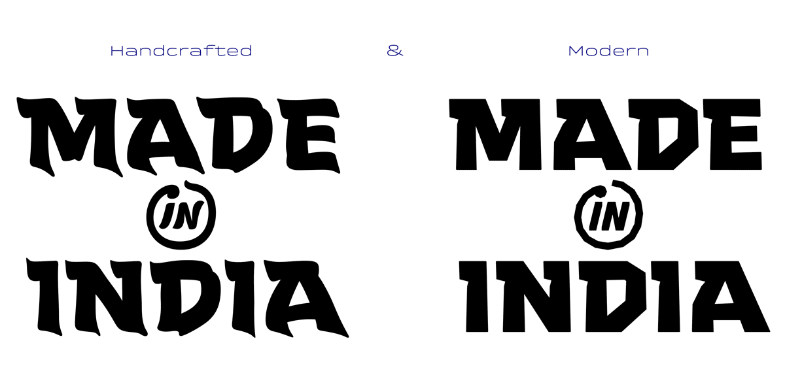
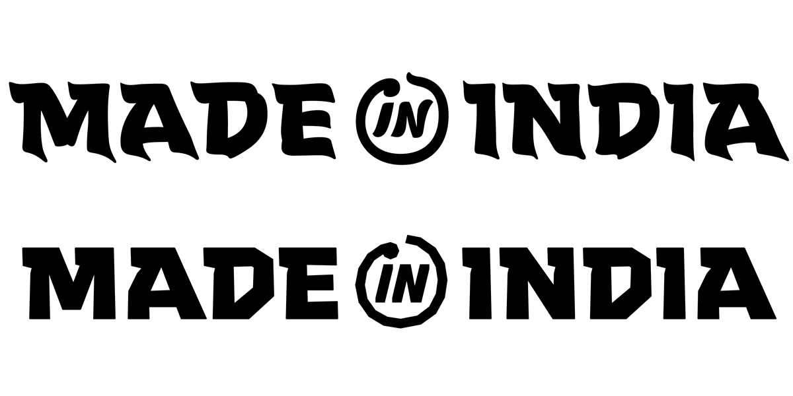
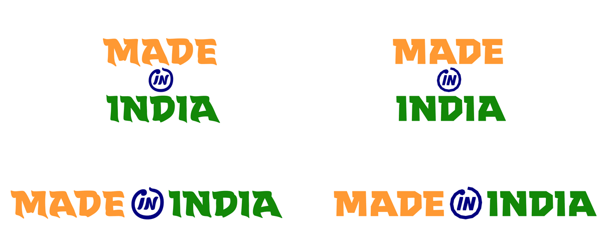
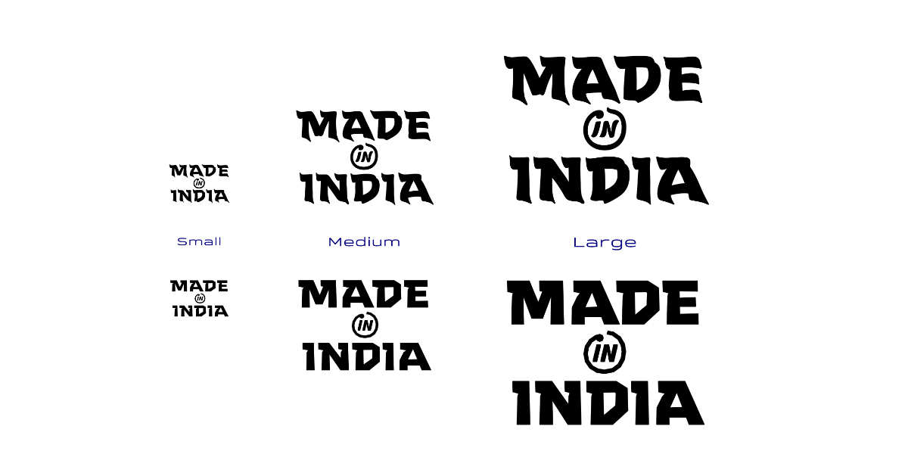

    

These logos were a self-initiated project by the Mumbai-based typeface design studio [Mota Italic](https://www.motaitalic.com) as a small gift to India. The logos are completely open sourced designs that can be used by anyone wanting to proudly show off their products as **Made in India**!

# The Logos

Each can be displayed “**Stacked**” vertically *(above)* or “**Linear**” horizontally *(below)*.

Not only that, but all come in both black and color versions!

Finally, there are size-specific versions to enable the highest quality rendering wherever the logo will be used.

This is more than just a simple logo: it’s a flexible & technically advanced system to help instill pride in the goods & objects **Made in India**.

- Much more about these designs and how to use them can be found in the **User Guides** in the Documentation folder ([PDF](Documentation/Made_in_India-Logo_User_Guide.pdf) & [MD](Documentation/Made_in_India-Logo_User_Guide.md)).

# About the Designs
India is a diverse republic. The population of +1.3 billion people co-exists with a variety of scripts, languages, and local cultures unlike any other nation. There is a continuity of thoughts & traditions that span centuries while simultaneously as a thoroughly modern advancement quickly propelling India to a sustainable and high-tech future.

The concept behind the Made in India logos is that they should be simple, purely typographic, secular, and apolitical. They were designed with many customizable options to make them fit almost any usage case. A “one size fits all” solution will not work when considering a logo that could be applied to any different medias and materials and in any possible shape or size.

It is impossible to distill so many facets into a single image. However, these Made in India logos seek to give form to two facets of contemporary India: preserving traditional hand made skills while also innovating with the latest technology.

This idea lead to the two logo styles: “Handcrafted” and “Modern”. At the core, both logos have the same skeletal structure, but on the outside, one clearly tells a story of the traditional culture of finely crafted work, while the other visualizes the future-thinking, technologically advanced India.

Not every usage case will precisely fall into either the Handcrafted or Modern categories, but most will find one of these appropriate for their needs or aesthetic.

# Copyright, License, & Thanks!

Code, fonts, and documentation copyright 2020 [Mota Italic](https://www.motaitalic.com).

The logo designs are released under the [MIT License](LICENSE).

The font files are released under the [Open Font License](Fonts/Open-Font-License.md).

Documentation is released under [Creative Commons](https://creativecommons.org/licenses/by/3.0/).

Special thanks to [@Mekkablue](https://github.com/mekkablue) for help with the font production.

:smile_cat: